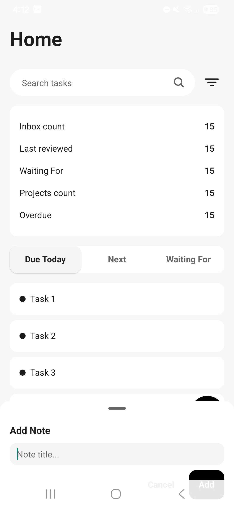
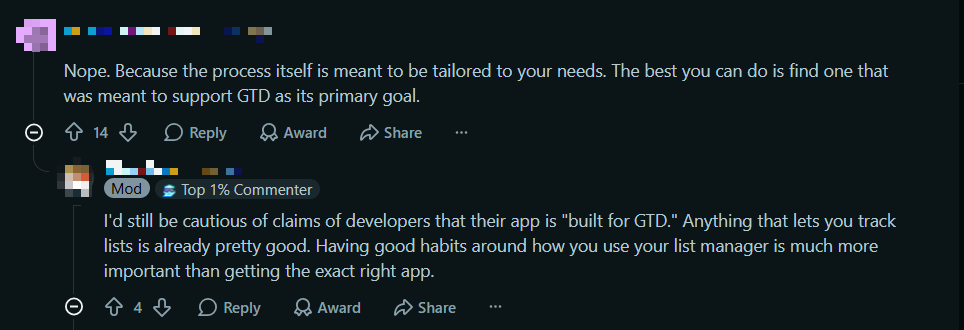
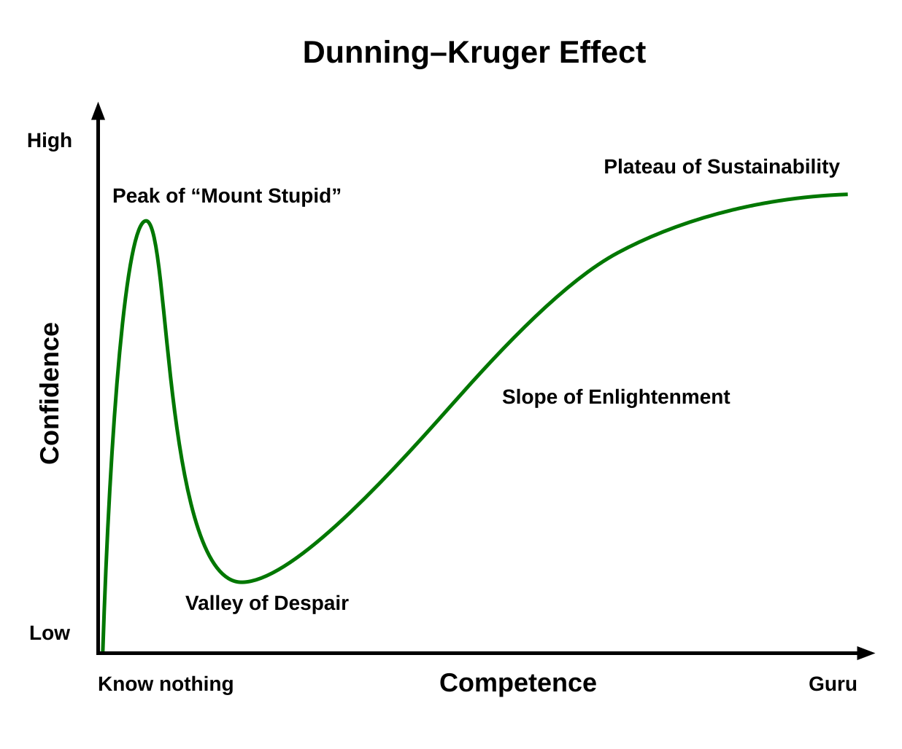

I'd been coding for maybe two months. I'd learned JavaScript, pivoted to AI agents in Python, and thought: I'm ready to build a business. Not a side project. A business.

Three weeks later, I downloaded someone else's app and realized mine was already dead.

This is the story of how I went from that confidence to knowing I was wrong — and why the failure was still worth it.

## The Setup

I'd just finished some important high school exams and had time to breathe for the first time in months. I started learning to code. JavaScript first, then AI agents in Python. I was picking things up fast, and that speed made me feel invincible.

Around the same time, I'd been trying to improve my productivity. I'd read about GTD — Getting Things Done — but never stuck with it. Tools like Notion and Todoist felt too complex, too long to set up. My attention span couldn't handle it.

So I had an idea: build a mobile GTD app for myself. Simple, clean, designed for people like me who wanted a simplified GTD workflow without the overhead. And maybe — ambitiously, I know — turn it into a business.

At the time, my confidence was sky high. I was learning so fast. How hard could building an app be?

## Building the App

I skimmed a React Native tutorial and jumped straight in. The first version, I wrote by hand. It was slow and messy.

Then I discovered vibe coding — using AI to help structure and generate code. I restarted the project ([Ord](https://github.com/aduc2612/Ord)), this time researching the tech stack a bit more. React Native for the frontend, Supabase for the backend. I defined the architecture, planned the features, and coded with actual structure instead of just throwing things at the wall.

It worked. The app was nearly done. It looked good. I was proud of it.

I thought: this is going to work.

## Searching for Users

I knew I needed to find people with the same problem. So I went to Reddit.

I expected to find a crowd. Instead, I found crickets. Two people, maybe, in comments that were months old. Nobody was actively looking for what I was building.

Worse, the GTD subreddit had one piece of advice that kept coming up: "Don't trust apps. Find your own setup." The mods explicitly said it. The community echoed it.

The people I wanted to help were being told not to look for what I was building.

That was the first crack in my confidence. But the real blow was still coming.

## The Reality Check

I kept searching. And then I found [Mindwtr](https://github.com/dongdongbh/mindwtr).

Open source. Free. Built specifically for the GTD workflow. Syncs across desktop and mobile. Every feature I'd spent three weeks building — and more I hadn't even thought of.

I stared at the screen. I'd been building a mobile-only app in a space where a better, free, cross-platform version already existed. Something I could have found in five minutes of research before writing a single line of code.

Three weeks of intense work, gone. Not because the code was bad. Not because I failed at building. Because I never checked whether what I was building needed to exist.

I downloaded Mindwtr that night. It worked better than my app. On my laptop too.

That was the moment I realized I wasn't a founder. I was a beginner who got excited and moved too fast.

## The Confidence Curve

There's a concept called the [Dunning-Kruger effect](https://en.wikipedia.org/wiki/Dunning%E2%80%93Kruger_effect). It describes how people with low ability at a task tend to overestimate their ability. There's a famous graph: confidence starts high when you know a little, crashes when you realize how much you don't know, then slowly climbs back as you actually learn.

I was at the top of that curve. Peak Mount Stupid. I knew just enough to build something, and that was enough to convince me I knew enough to sell it.

The more you learn, the more you realize you don't know. I knew React Native basics. I knew Supabase. I knew how to scaffold an MVP with structure. But I didn't know git beyond `add` and `commit`. I didn't know database design beyond foreign keys. I didn't know indexing, caching, N+1 query problems, or any of the things that separate a prototype from a product.

I'd learned just enough to be dangerous. Not enough to be useful.

## What I'm Doing Now

I'm slowing down.

I'm learning git properly — rebase, merge conflicts, real workflows. I'm learning databases — indexing, performance, design patterns. I'm learning the fundamentals I skipped because I was too busy chasing the next idea.

It's less exciting than building a business. It's more valuable.

Learning by doing works. I'm not going to pretend those three weeks were wasted. I can scaffold an MVP now. I know React Native, Supabase, how to structure a project. I learned what market research actually means. I learned that building something is not the same as building something people need.

But I also learned that confidence without competence is just ignorance with momentum. And momentum without direction is just noise.

## What I'd Tell a Friend

If you're in the position I was — learning fast, feeling invincible, ready to build the next big thing — here's what I'd say:

Build things. Absolutely. Learning by doing is real, and it's faster than tutorials.

But spend a day searching for existing solutions before you write a line of code. If someone already built it better and free, that's not a defeat. That's research you should have done first.

And learn the fundamentals alongside your projects. Git, databases, software design. Not after you fail. Alongside. They're the difference between a prototype and something production-ready.

Most importantly: don't confuse early momentum with mastery. Learning fast doesn't mean you've learned enough. It means you're at the top of the confidence curve — and the drop is coming.

Have you ever been on top of that confidence curve? What snapped you out of it?
