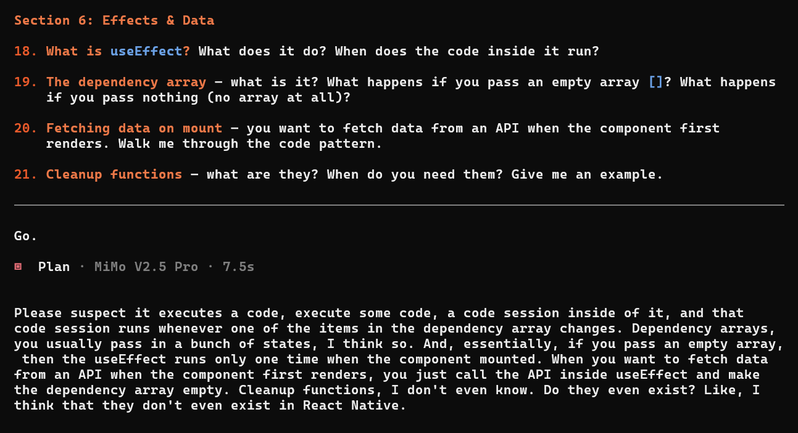

I've been building mobile apps with React Native and Supabase for months. I had a working GTD app, I could scaffold a project, wire up state, fetch data, handle auth. So when I decided it was time to move on to full-stack frameworks like Next.js, I figured I already knew React well enough.

Then I actually thought about it. I work with _React Native_, not React. A lot of the concepts are similar, but there are real differences — forms, routing, how lists render, even what JSX compiles to under the hood. I wasn't sure how much of my knowledge would transfer directly, and how much I'd need to relearn.

So before jumping into Next.js, I asked an AI to quiz me on React fundamentals. 30 questions across 10 sections, topics from [Traversy Media's React course](https://start.dev/course/react-fundamentals) — JSX, props, state, effects, hooks, routing. The basics.

**I scored 3 out of 10.**

## How the roast worked

I gave the AI my topic list and said: go through each section, ask me to explain things in my own words, and score me honestly. No Googling, no assistance. Just what I actually know off the top of my head.

It asked me things like "what is JSX?", "what's the difference between these two state updates?", "what does the cleanup function in useEffect do?" — and gave me a score after each section with a brief explanation of what I got wrong.

**Here's the damage:**

| Section          | Score | Verdict                                       |
| ---------------- | ----- | --------------------------------------------- |
| Welcome to React | 6/10  | Practical intuition, fuzzy mental model       |
| JSX              | 4/10  | Knows patterns, misses mechanics              |
| Props            | 4/10  | `children` prop unknown, immutability weak    |
| State & Events   | 3/10  | Missing functional updates, immutable updates |
| Forms            | 0/10  | No knowledge (React Native difference)        |
| Effects & Data   | 3/10  | Missing cleanup, dependency array mechanics   |
| Sharing State    | 3/10  | Used context but can't articulate it          |
| More Hooks       | 1/10  | useRef, useReducer unknown                    |
| Routing          | 1/10  | Platform difference, skipped                  |

Overall: **3/10.**

## The rough moments

The **JSX** question was probably the most embarrassing. It asked me what JSX _actually_ is, and I said something like "it's kind of like special HTML where you can add variables." That's what it _looks like_, not what it _is_. JSX is JavaScript syntax that compiles to `React.createElement()` calls. It's not HTML at all. I'd been writing JSX for months without knowing that.

The **functional updates** question was frustrating because I actually do know the difference between `setCount(count + 1)` and `setCount(prev => prev + 1)`. I've Googled it before, I understand the concept, and I've used both. But in the moment, I just froze and said I didn't know. The AI showed me this example afterward:

```jsx
// count is stale in this closure
setCount(count + 1); // 0 → 1
setCount(count + 1); // 0 → 1 (still sees 0!)
setCount(count + 1); // 0 → 1

// prev is always the latest
setCount((prev) => prev + 1); // 0 → 1
setCount((prev) => prev + 1); // 1 → 2
setCount((prev) => prev + 1); // 2 → 3
```

I knew this. I just couldn't recall it under pressure. Which honestly might be _worse_ than not knowing — if I can't explain something when asked, do I really understand it?

**Cleanup functions**, on the other hand, I _genuinely_ didn't know. Or maybe I've used them before without realizing what they were called. The concept of returning a function from `useEffect` that cleans up timers, event listeners, subscriptions — that was new to me. I even asked "do they even exist in React Native?" They do. I just never needed them badly enough to learn.



## What I actually got right

It wasn't all bad. I got conditional rendering right (8/10), which makes sense since I use ternaries in JSX all the time. I understood prop drilling intuitively (6/10) — the chain-breaking risk, the annoyance of passing props through five levels of components. I just couldn't name the formal solutions.

And I actually had used Context for auth and theme in my apps. But during the quiz I panicked and started talking about Zustand and Redux, which I've never used. The AI called it "hallucinating to cover gaps." Fair enough.

## What this showed me

The biggest thing this quiz revealed is that there's a real **gap** between being able to _build_ something and being able to _explain_ how it works. I can write a React Native app that works. But when someone asks me to explain _why_ I'm writing it that way, I often can't.

This is basically the **Feynman Technique** in action: explain something simply, and wherever you can't, that's the gap. The quiz forced me to explain things in my own words without Googling, and every place I stumbled was a place my understanding was shallow.

And it's not that React Native "made me worse" at React or anything like that. It's more that the knowledge **doesn't transfer directly**. React Native and React share a lot — components, state, effects, JSX — but there are differences in how things work under the hood. FlatList handles list rendering differently than `.map()` on the web. React Navigation is a completely different paradigm from React Router. Forms in React Native don't use `<form>` or controlled inputs the way web React does. So when I was quizzed on React web specifically, there were gaps I didn't expect.

## What I'm still confused about

As I'm writing this, there are things I still don't fully understand:

- **`useReducer` vs `useState`**: I know `useReducer` exists. I know it's for "complex state logic." But I can't tell you when I'd actually reach for it over `useState`. Every explanation I've read feels abstract — I haven't hit a real problem where `useState` was clearly the wrong tool.
- **`useRef`**: I've seen it in code examples. I think it's for accessing DOM elements? But I've never used it in React Native, and I'm not sure what problem it solves that state doesn't.
- **Dependency arrays**: The quiz flagged that I don't understand how `useEffect` dependency arrays actually work. I know the rule — "put everything you use inside the effect into the array" — but I don't have a mental model for what happens when you get it wrong, beyond "infinite loops maybe?"

I'm sharing these not as things I'll fix later, but as things I'm genuinely confused about right now. If you know these well, I'd love to hear how you think about them.

## What's next

First thing: I'm working through [Traversy Media's React fundamentals course](https://start.dev/course/react-fundamentals), but with code review exercises instead of just watching videos. The AI gives me a component with some issues — bugs, anti-patterns, things that work but _aren't ideal_ — and I try to find and explain what's wrong. It's faster than writing code from scratch, and it tests whether I actually understand the concepts or just recognize patterns. I'll re-quiz myself after each section to see what actually stuck.

The goal is to **actually understand React** before moving to Next.js. Not just follow patterns and hope for the best.

If I fill the gaps successfully, I'll turn the notes into a React Native → React transition cheatsheet. The full roast session is also coming to YouTube soon — you can watch me get quizzed in real time and see exactly where I froze up.

If you've been building with React, try the same quiz. Pick any 5 topics from the fundamentals and explain them out loud without Googling. You'll find your gaps in 10 minutes.
