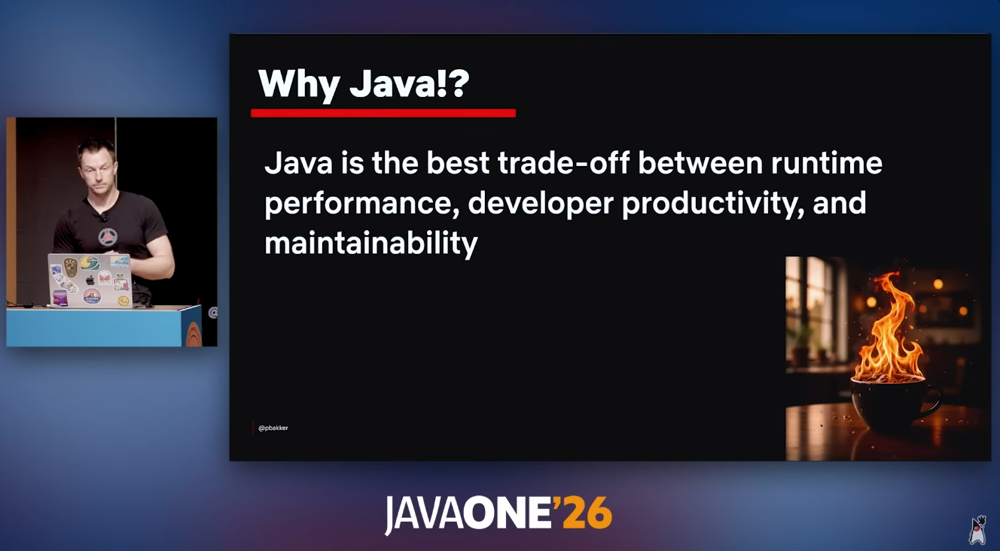
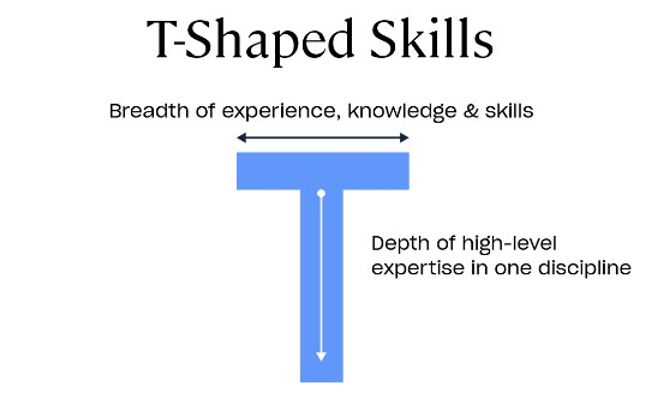

> Java is the best trade-off between runtime performance, developer productivity, and maintainability.

That's Paul Bakker, a Netflix engineer, in a JavaOne 2026 talk called [How Netflix Uses Java](https://www.youtube.com/watch?v=ucJTPda_zx0&t=571s). Netflix serves hundreds of millions of people, and its backend runs on the JVM. Not because the company is stuck. It chose this, deliberately, year after year.

Meanwhile, every tech forum I open tells me Java is dead. Boring. Legacy. A language for old enterprise apps nobody wants to touch.

I'm a high school student in Vietnam who taught himself to code. I learned JavaScript, [built a React Native app in three weeks](https://adngx.com/posts/i-built-a-mobile-app-in-3-weeks-then-i-found-out-it-already-existed-for-free), then [got roasted on React fundamentals](https://adngx.com/posts/i-thought-i-knew-react-then-i-got-roasted) by an AI quiz that scored me 3/10. Since then I've been slowing down and learning the fundamentals I skipped.

Everything I've built lives in the "modern" ecosystem: React Native, Supabase, TypeScript. And in 2026, I decided to learn Java and Spring Boot anyway.

I'm not writing this as a Java evangelist. I had to be argued out of "Java is dead." Here's why.

## Why I believed Java was dead

Let me steelman the "Java is dead" take, because I genuinely believed most of it:

- **Cold starts:** 3-10 seconds, vs under a second for Node.
- **Boilerplate:** more ceremony per feature than any modern framework.
- **Two languages:** a Java backend means Java and JavaScript, instead of TypeScript everywhere.
- **"Everyone uses Next.js now."**

And there's an honest data point against me: Java isn't even in the top 10 most-requested technologies in the German job listings for 2026. TypeScript is #1. If I picked a stack by raw listing counts, I'd stay in JS land.

I'm not. The Netflix talk is a big part of why.

## The Netflix talk

Netflix can afford any stack in the world. And they use the modern stuff where it fits: Go for platform sidecars, JavaScript and Swift for mobile, Python for data science. Java is their backend default because, in their words, it's the best _trade-off_. Not the fastest at any one thing. The best balance of all three:

- **Runtime performance:** the JVM is a runtime tuned for over 25 years, and Netflix runs it on Java 21 and 25. Performance you can trust is worth more than peak performance you have to babysit.
- **Developer productivity:** the tooling is mature and you rarely rebuild infrastructure from scratch. Modern Java removed most of the old friction: records, sealed classes, pattern matching, virtual threads.
- **Maintainability:** static types, explicit code, and code written a decade ago that still runs in production. This is the pillar that never shows up in "which language is hottest" polls, and the one that matters most over a career.

And here's the detail that sealed it for me: they're fully on Spring Boot 3 and migrating to Spring Boot 4 with **Claude Code**. The largest streaming service on the planet is doing its framework migration with the same AI-assisted workflow I use every day, on a framework people call legacy.

That flipped "Java is boring" into "Java is stable enough that 25 years of tooling is worth investing in."

## What this means for me

Netflix's scale isn't my scale. But the reasoning transfers.

### The market I'm actually aiming at

I'm planning to study computer science in Germany, likely in Dortmund, one of the most Java-dense enterprise markets in the country. adesso, one of Germany's largest IT-services companies, and Materna are headquartered there, surrounded by banks, insurers, and public-sector IT. German recruiters describe Java as "constant demand" in enterprise, and Bitkom counts 155,000 unfilled IT positions.

The honest version: Java isn't the most-listed technology. It's the deep, T-shaped skill for the slice of the market I'm targeting: the biggest, most stable employers.

### Depth beats breadth, especially with AI

Fast Company: AI is "exceptionally good at replacing shallow knowledge." Moderate competence across several domains now competes against systems that synthesize all of them instantly. Every 2026 market analysis I've read converges on the same model: a broad base plus one deep specialization. Pure generalists are in structural decline.

My broad base is React and TypeScript. My deep skill is becoming Java and Spring Boot.

Java is a good deep bet for the AI era specifically. Its static, deterministic syntax is easier for LLMs to model than dynamic languages, so generated code is more often right on the first pass. And the boilerplate-heavy parts of Spring Boot (controllers, services, repositories) are exactly what AI writes best. The "Java is too verbose for AI-assisted development" argument is from 2019. In 2026, it's backwards.

### Startup languages churn. Java doesn't.

A heavily-upvoted r/java comment I found puts it better than I can:

> When you consider that a large corporation can employ as many people as 500-10,000 startups and that only 10% of those startups survive and the rest are replaced by companies that eventually pick some other language according to the fashion of the day, you see why what startups do is not necessarily a good indicator of where the industry is going.

Quick applications have chased the language of the moment for decades: PHP, then Ruby, then Python, then Node. Java has been the constant through all of them. The survivors that bet on the fashionable option? Facebook picked PHP and had to invent Hack to scale it. Stripe and Shopify picked Ruby and spent years bolting types onto it. The commenter's punchline: "those who picked Java (and survived) virtually always ended up happy with their choice."

That number reframed everything for me: optimizing your career for the startup language du jour means optimizing for a tiny fraction of the industry. And it's not just theory. Eric Cupsa, a developer I follow, learned Java and Spring Boot at university, landed at Amazon (whose backend is famously ~80% Java), and went on to found startups, including one on a Spring Boot backend. Java got him through the door.

## The trade-offs I'm accepting

I'm not claiming Java is better at everything. I'm claiming it's better for the bet I'm making:

| Giving up                                        | Why it's OK                                                                                                                              |
| ------------------------------------------------ | ---------------------------------------------------------------------------------------------------------------------------------------- |
| One-language full-stack (TypeScript everywhere)  | React/TS frontend + Java backend is one of the most employable combinations in the German market. Two languages means more jobs          |
| Faster prototyping (hot reload, no compile step) | My priority right now is stability-first employers, not shipping consumer MVPs in a weekend                                              |
| NestJS and TypeScript-backend depth              | Spring Boot transfers to more of the market I'm targeting, and my university coursework will reinforce Java. It's leverage, not friction |

## What I'm doing now

The plan, build-first, roughly 7-14 hours a week:

1. **Java fundamentals.** [Bro Code's full Java course](https://www.youtube.com/watch?v=xTtL8E4LzTQ&t=24126s): OOP, collections, on a modern JDK.
2. **Functional Java.** [Amigos Code's](https://www.youtube.com/@amigoscode) functional programming course, for streams and optionals. It's the one real gap in the basics.
3. **Modern Java.** Records, sealed classes, pattern matching, virtual threads.
4. **Spring Boot.** The 13-step path: Maven/Gradle → dependency injection → Spring Boot → data access → security → testing → Docker.
5. **A fun layer.** Minecraft modding, where `@Mod` / `@SubscribeEvent` maps almost 1:1 onto Spring's `@Component` / `@Service` / `@Autowired`. Dependency injection won't feel like magic.
6. **A real project.** A CRUD app with PostgreSQL and Docker. Amigos Code's Java roadmap calls Spring Boot "the king" of Java frameworks. Kings need a kingdom.

Every session produces output: code, a diagram, a post like this one. That's the rule I learned the hard way in my first two projects.

## The bottom line

In 2026, everyone told me Java was dead. A Netflix engineer told me it's the best trade-off between runtime performance, developer productivity, and maintainability. The German enterprise market calls it constant demand. And the history of startup stacks says the language that's exciting today might not be the one that pays my bills in a decade.

So I'm going deep on the boring one. Boring, it turns out, is a feature.

If you're picking a stack this year, what made you choose it? And what did you give up?
